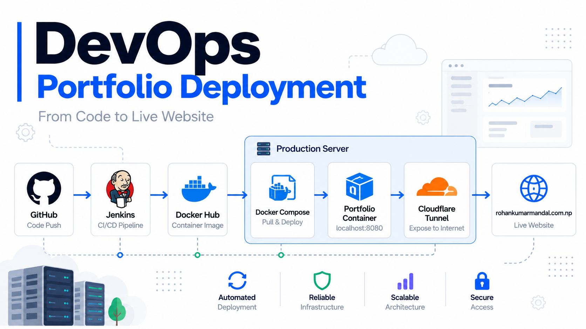

# DevOps Portfolio CI/CD Project

> **Automated CI/CD pipeline for a React/Vite portfolio using GitHub, Jenkins, Docker, Docker Hub, Docker Compose, Nginx, and Cloudflare Tunnel.**



## Live Website

**[rohankumarmandal.com.np](https://rohankumarmandal.com.np/)**

This project demonstrates an automated workflow from **source code changes to a publicly accessible containerized application**.

---

## Project Overview

This project is my personal portfolio deployment environment and a practical demonstration of my DevOps skills.

The application is containerized using Docker and deployed through a Jenkins CI/CD pipeline.

Whenever code is pushed to the GitHub repository:

```text
GitHub
   ↓
Webhook
   ↓
Jenkins
   ↓
CI Pipeline
   ↓
Docker Build
   ↓
Docker Hub
   ↓
Docker Compose
   ↓
Portfolio Container
   ↓
Cloudflare Tunnel
   ↓
Live Website
```

The goal is to automate the complete application delivery process while keeping the deployment reproducible and version controlled.

---

# Architecture

The current architecture uses the following components:

```text
Developer
    │
    │ git push
    ▼
GitHub
    │
    │ Webhook
    ▼
Jenkins
    │
    ├── Install Dependencies
    ├── Security Audit
    ├── Build Application
    ├── Docker Build
    └── Docker Push
            │
            ▼
       Docker Hub
            │
            ▼
      Docker Compose
            │
            ▼
     Portfolio Container
            │
       localhost:8080
            │
            ▼
    Cloudflare Tunnel
            │
            ▼
rohankumarmandal.com.np
```

### Architecture Diagram

The detailed architecture is available here:

```text
docs/architecture.png
```

---

# Technology Stack

| Technology | Purpose |
|---|---|
| React | Frontend application |
| Vite | Frontend build tool |
| Git | Version control |
| GitHub | Source code repository |
| Jenkins | CI/CD automation |
| npm | Dependency management |
| npm audit | Dependency security auditing |
| Docker | Application containerization |
| Docker Hub | Container image registry |
| Docker Compose | Container deployment |
| Nginx | Web server inside the container |
| Cloudflare Tunnel | Secure public access |
| Linux | Server environment |

---

# CI/CD Pipeline

The Jenkins pipeline performs the following stages:

### 1. Checkout

Jenkins retrieves the latest source code from GitHub.

```text
GitHub → Jenkins
```

---

### 2. Install Dependencies

Dependencies are installed using:

```bash
npm ci
```

Using `npm ci` provides a clean and reproducible dependency installation based on `package-lock.json`.

---

### 3. Security Audit

The pipeline performs an npm dependency security audit:

```bash
npm audit --audit-level=high
```

If high-severity vulnerabilities cause the audit to fail, the pipeline stops.

---

### 4. Build Application

The React/Vite application is built using:

```bash
npm run build
```

This generates the production-ready `dist/` directory.

---

### 5. Docker Build

A multi-stage Dockerfile builds the application and packages the production files with Nginx.

Example image tags:

```text
rohanmandal798/portfolio:8
rohanmandal798/portfolio:latest
```

The Jenkins build number is used for versioned images.

---

### 6. Docker Hub Push

The generated Docker image is pushed to Docker Hub.

```text
Jenkins
   ↓
Docker Build
   ↓
Docker Hub
```

Two tags are maintained:

```text
:<BUILD_NUMBER>
:latest
```

For example:

```text
portfolio:8
portfolio:latest
```

The versioned tag allows a specific build to be identified and deployed.

---

### 7. Docker Compose Deployment

Docker Compose deploys the exact Jenkins build:

```bash
IMAGE_TAG=${BUILD_NUMBER} docker compose pull
IMAGE_TAG=${BUILD_NUMBER} docker compose up -d
```

The Compose configuration uses:

```yaml
image: rohanmandal798/portfolio:${IMAGE_TAG:-latest}
```

Therefore:

```text
Build #8
   ↓
IMAGE_TAG=8
   ↓
portfolio:8
```

---

### 8. Health Check

After deployment, Jenkins checks the application:

```bash
curl http://localhost:8080
```

A successful HTTP response confirms that the application is reachable.

---

# Docker Architecture

The application uses a multi-stage Docker build.

```text
Node.js
   │
   ├── Install dependencies
   ├── Copy source code
   └── npm run build
            │
            ▼
        dist/
            │
            ▼
      Nginx Alpine
            │
            ▼
     Production Image
```

The final container contains:

```text
Nginx
+
React production files
```

The container exposes port `80` internally.

The host maps it to:

```text
127.0.0.1:8080
```

---

# Docker Compose

The deployment configuration is version controlled inside the GitHub repository.

```yaml
services:
  portfolio:
    image: rohanmandal798/portfolio:${IMAGE_TAG:-latest}
    container_name: portfolio
    restart: unless-stopped
    ports:
      - "127.0.0.1:8080:80"
```

This keeps the deployment configuration alongside the application source code.

---

# Cloudflare Tunnel

The portfolio container is not directly exposed to the public internet.

The application listens locally on:

```text
127.0.0.1:8080
```

Cloudflare Tunnel connects the public domain to the local application:

```text
Internet
   ↓
Cloudflare
   ↓
Cloudflare Tunnel
   ↓
127.0.0.1:8080
   ↓
Docker Container
```

Public endpoint:

**https://rohankumarmandal.com.np/**

This allows the application to be publicly accessible without directly exposing the container port to the internet.

---

# Repository Structure

```text
portfolio/
│
├── public/
│
├── src/
│   ├── components/
│   ├── assets/
│   └── ...
│
├── docs/
│   └── architecture.png
│
├── Dockerfile
├── docker-compose.yml
├── Jenkinsfile
├── index.html
├── package.json
├── package-lock.json
├── tsconfig.json
├── vite.config.ts
└── README.md
```

---

# Jenkins Pipeline

The pipeline is defined as code using:

```text
Jenkinsfile
```

Current pipeline:

```text
Checkout
   ↓
Install Dependencies
   ↓
Security Audit
   ↓
Build Application
   ↓
Docker Build
   ↓
Docker Hub Push
   ↓
Deploy to Localhost
   ↓
Health Check
```

This allows the CI/CD configuration to be version controlled together with the application.

---

# Deployment Flow

A normal website update follows this process:

### Developer makes a change

```bash
git add .
git commit -m "Update portfolio"
git push origin main
```

### GitHub triggers Jenkins

```text
GitHub
   ↓
Webhook
   ↓
Jenkins
```

### Jenkins builds the application

```text
npm ci
npm audit
npm run build
```

### Jenkins creates a Docker image

```text
portfolio:<BUILD_NUMBER>
```

### Image is pushed to Docker Hub

```text
Docker Hub
└── rohanmandal798/portfolio
```

### Docker Compose deploys the new version

```text
portfolio:<BUILD_NUMBER>
        ↓
localhost:8080
```

### Cloudflare exposes the application

```text
localhost:8080
      ↓
Cloudflare Tunnel
      ↓
rohankumarmandal.com.np
```

---

# Key DevOps Practices Demonstrated

### Continuous Integration

- GitHub source control
- Webhook-based Jenkins trigger
- Automated dependency installation
- Automated application build
- Dependency security audit

### Continuous Delivery / Deployment

- Automated Docker image creation
- Docker Hub image publishing
- Versioned container images
- Docker Compose deployment
- Automated health checks

### Containerization

- Multi-stage Docker build
- Nginx production image
- Docker Compose
- Versioned Docker images

### Infrastructure & Networking

- Linux server
- Local container networking
- Port mapping
- Cloudflare Tunnel
- Public domain routing

### Security

- `npm audit`
- Jenkins credential management
- Docker Hub authentication through Jenkins credentials
- No secrets stored in source code

---

# Security

Sensitive credentials are not stored inside the repository.

Jenkins credentials are used for authentication with external services.

Examples include:

```text
Docker Hub credentials
GitHub credentials
```

Credentials are referenced by Jenkins credential IDs rather than hardcoded into the pipeline.

Example:

```groovy
credentialsId: 'dockerhub'
```

---

# Versioned Deployments

Each Jenkins build produces a versioned Docker image.

Example:

```text
Build #6 → portfolio:6
Build #7 → portfolio:7
Build #8 → portfolio:8
```

This provides traceability between:

```text
Git commit
    ↓
Jenkins build
    ↓
Docker image
    ↓
Deployment
```

It also provides a foundation for future rollback capabilities.

---

# Project Goals

This project was built to gain practical experience with:

- CI/CD
- Jenkins
- Docker
- Docker Compose
- Container registries
- Linux server administration
- Deployment automation
- Cloudflare networking
- Infrastructure automation
- DevOps workflows
- Secure credential management

---

# Future Improvements

Planned improvements include:

- [ ] Trivy container vulnerability scanning
- [ ] Automated rollback
- [ ] Production deployment
- [ ] Deployment notifications
- [ ] Improved container health checks
- [ ] Monitoring with Prometheus
- [ ] Grafana dashboards
- [ ] Centralized logging
- [ ] Deployment approval workflow

---

# Skills Demonstrated

```text
Linux Administration
        │
        ├── Docker
        ├── Docker Compose
        └── Networking
                │
                ▼
             DevOps
                │
        ┌───────┴────────┐
        │                │
      Jenkins          GitHub
        │                │
        └───────┬────────┘
                │
             CI/CD
                │
                ▼
          Cloud Deployment
                │
                ▼
        Cloudflare Tunnel
```

---

# Live Project

**Website:**  
https://rohankumarmandal.com.np/

**Source Code:**  
https://github.com/rohanmandal798/portfolio

---

# About Me

I am a **Cybersecurity graduate and System Administrator transitioning into DevOps**, with a focus on Linux, cloud infrastructure, automation, CI/CD, containers, networking, and security.

This project represents my practical work in building and maintaining an automated application delivery pipeline.

### Areas I am currently developing

```text
Linux
AWS
Docker
Kubernetes
Jenkins
Terraform
CI/CD
Cloud Security
DevSecOps
Monitoring
Networking
```

---

## Project Status

**Status:** Active

**Environment:** Linux

**Deployment:** Automated

**CI/CD:** Jenkins

**Containerization:** Docker

**Registry:** Docker Hub

**Public Access:** Cloudflare Tunnel

**Application:** React + Vite

---

### A small README tip

For the architecture image, put the PNG here:

```text
docs/architecture.png
```

Then this line:

```markdown

```
