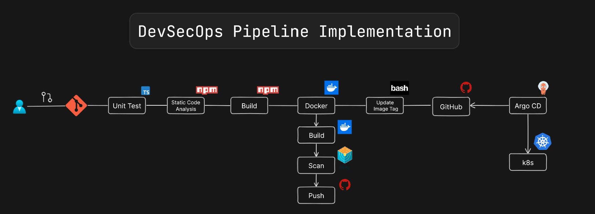
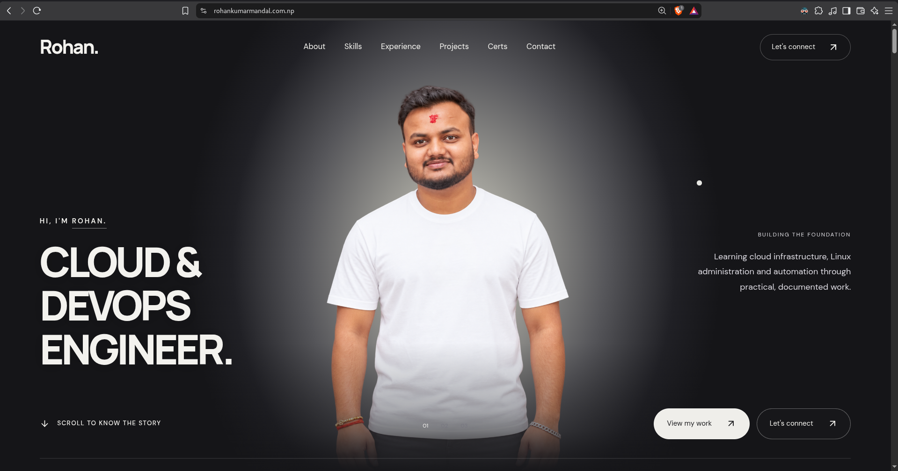

# DevSecOps Pipeline Implementation for Tic Tac Toe Game





## Features


## Technologies Used

- React 18
- TypeScript
- Tailwind CSS
- Lucide React for icons

## Project Structure

```
src/
├── components/
│   ├── Board.tsx       # Game board component
│   ├── Square.tsx      # Individual square component
│   ├── ScoreBoard.tsx  # Score tracking component
│   └── GameHistory.tsx # Game history component
├── utils/
│   └── gameLogic.ts    # Game logic utilities
├── App.tsx             # Main application component
└── main.tsx           # Entry point
```


## Getting Started

### Prerequisites

- Node.js (v14 or higher)
- npm

### Installation

1. Clone the repository:
   ```bash
   git clone https://github.com/rohanmandal798/portfolio.git
   cd portfolio
   ```

2. Install dependencies:
   ```bash
   npm install
   ```

3. Start the development server:
   ```bash
   npm run dev
   ```

4. Open your browser and navigate to `http://127.0.0.1:5173/`


## Building and Testing Docker image

Build the image:

```
docker build -t rohanmandal798/portfolio:v1 .
```


Start the Container:
```
docker run -d --name portfolio -p 3000:80 rohanmandal798/portfolio:v1   
```

## Building for Production

To create a production build:

```bash
npm run build
```

The build artifacts will be stored in the `dist/` directory.


# Github login

```
docker login ghcr.io -u rohanmandal798
```
